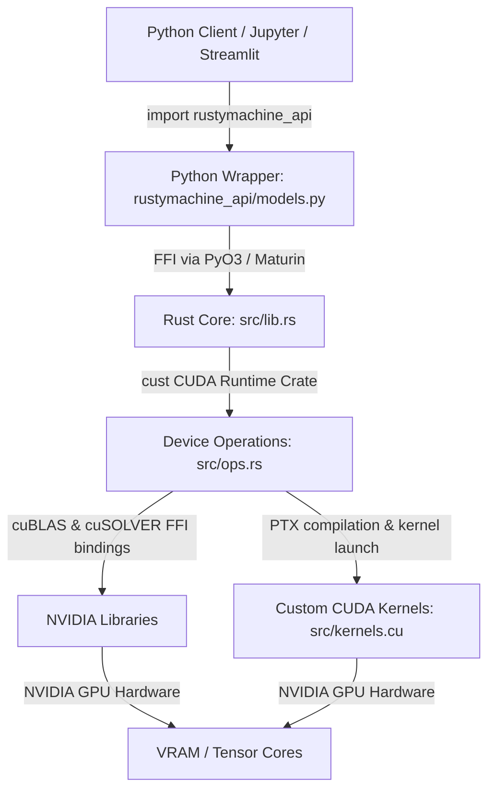

# Rusty Machine

GPU-accelerated machine learning in Rust with high-level Python bindings, powered by CUDA, cuBLAS, and cuSOLVER.

`rusty-machine` offers scikit-learn-compatible Python interfaces for Ridge Regression and Logistic Regression, running all heavy computational routines (e.g., matrix factorization, batch gradient calculation, and updates) natively on NVIDIA GPUs with zero-copy data streaming.

---

## Key Features & Use Cases

*   **Hybrid Rust-CUDA Engine**: Memory safety, zero-cost abstractions, and clean concurrency in Rust coupled with high-performance native CUDA kernels.
*   **Scikit-Learn Compatibility**: Drop-in replacements for standard estimators (`LinearRegression` and `LogisticRegression`) supporting `fit()`, `predict()`, and `predict_proba()` routines.
*   **Zero-Copy VRAM Transfers**: Integrates with the `CuPy` ecosystem to pass device memory pointers directly over FFI, avoiding redundant GPU-to-CPU host transfers.
*   **Carbon Footprint Tracking**: Built-in energy tracking using `CodeCarbon` to measure training and inference emission profiles.
*   **Interactive Benchmarking Dashboard**: Streamlit-based graphical suite for comparing performance against standard CPython implementations.

---

## Project Architecture

The library is structured across three core layers:



### 1. Python Wrapper (`rustymachine_api/models.py`)
Provides scikit-learn-compatible estimator classes. Manages CPU-GPU data movement via `CuPy`. NumPy arrays are converted to contiguous, pinned GPU memory using optimized memory pooling to avoid OS page-locking overhead.

### 2. Rust Core (`src/lib.rs` & `src/ffi.rs`)
Defines the `rusty_machine` native extension module using `PyO3`. It exposes low-level FFI bindings to `cuBLAS` (SGEMM/SGEMV) and `cuSOLVER` (Spotrf/Spotrs Cholesky solvers) and encapsulates them behind safe Rust APIs.

### 3. Native CUDA Kernels (`src/kernels.cu` & `src/ops.rs`)
Contains hand-written, performance-optimized CUDA kernels compiled to PTX at build-time. It manages context synchronization, stream captures, and GPU memory safety.

---

## Design Choices & Optimizations

### CUDA Graphs API
For mini-batch gradient descent (Logistic Regression), launching kernels (GEMM, activation, reduction, regularization updates) for every batch over hundreds of epochs introduces significant CPU overhead and synchronization latency.
*   **Design Choice**: We utilize **CUDA Stream Captures** (`cuStreamBeginCapture` and `cuStreamEndCapture`) to record the entire training operations sequence for one epoch.
*   **Result**: The recorded operations are instantiated as a static `cudaGraphExec_t` executing completely on the GPU, avoiding CPU thread context-switching and minimizing dispatch latency.

### Tensor Core Dispatch via Padding
NVIDIA Ampere and newer architectures feature Tensor Cores that operate with extreme throughput on matrices aligned to 16-byte boundaries (e.g. multiples of 16 for float32).
*   **Design Choice**: We automatically pad feature dimensions to a multiple of 16 on the GPU prior to operations (`_pad_for_tensor_cores`).
*   **Result**: This allows cuBLAS SGEMM routines to run on the Tensor Core Tensor Float 32 (TF32) path, unlocking up to 5x higher hardware throughput.

### Bank-Conflict-Free Tiled Matrix Transpose
Naive global memory transposes suffer from uncoalesced memory accesses, bottlenecking memory bus bandwidth.
*   **Design Choice**: We implemented a shared-memory tiled transpose inside `src/kernels.cu`. Threads load a $32 \times 32$ tile into shared memory in a coalesced manner.
*   **Result**: To prevent shared memory bank conflicts (where multiple threads access the same memory bank simultaneously), the shared array is padded dynamically as `tile[32][33]`.

### Cholesky-based Normal Equation
Standard Linear Regression solves $\theta = (X^T X)^{-1} X^T y$. Inverting matrices via LU decomposition is computationally intensive and numerically unstable.
*   **Design Choice**: We solve Ridge regression using cuSOLVER's Cholesky factorization (`cusolverDnSpotrf` and `cusolverDnSpotrs`) to compute $\theta = (X^T X + \alpha I)^{-1} X^T y$.
*   **Result**: Cholesky factorization exploits the symmetric positive-definite structure of the covariance matrix, executing approximately **2x faster** than standard LU decomposition.

---

## Empirical Benchmarks

The following benchmarks were evaluated in **Quick Mode** on a dataset with $100,000$ observations and $50$ features. Timings represent the mean of 5 runs (excluding warm-ups).

### Training Convergence Latency

| Estimator / Algorithm | Scikit-learn (CPU) | Rusty Machine (GPU) | Speedup / Multiplier | Score ($R^2$ / Accuracy) | Coefficient Agreement ($R^2$) |
| :--- | :---: | :---: | :---: | :---: | :---: |
| **Ridge Regression** ($\alpha=0.1$) | $0.0210 \text{s}$ | $0.0119 \text{s}$ | **1.8x** | $0.9964$ | $1.000000$ |
| **Logistic Regression L2** | $1.0512 \text{s}$ | $0.0307 \text{s}$ | **34.3x** | $0.7630$ vs $0.7628$ | $0.999980$ |
| **Logistic Regression L2 + Momentum** | $0.9673 \text{s}$ | $0.0310 \text{s}$ | **31.2x** | $0.7617$ vs $0.7628$ | $0.999269$ |
| **Logistic Regression L1 (Lasso)** | $1.2879 \text{s}$ | $0.0348 \text{s}$ | **37.0x** | $0.7629$ vs $0.7628$ | $0.999907$ |

*Note: Scikit-learn benchmarks utilize the CPU SAGA solver for logistic regression to guarantee identical optimization behavior.*

### Inference Latency ($20,000$ Predictions)

*   **Ridge Prediction**: $0.0044\text{s}$ (GPU) vs $0.0044\text{s}$ (CPU) — **1.0x**
*   **Logistic Prediction**: $0.0035\text{s}$ (GPU) vs $0.0034\text{s}$ (CPU) — **1.0x**

---

## Installation & Setup

### Requirements
*   NVIDIA GPU with compute capability $\ge 6.0$
*   CUDA Toolkit (12.x recommended)
*   Python $\ge 3.10$
*   Rust Compiler & `cargo`

### Compilation & Linking Workaround
Depending on your Linux distribution, CUDA system-wide libraries might be installed under `/usr/lib/x86_64-linux-gnu` instead of the typical `/usr/local/cuda/lib64`. This can cause Cargo's `find_cuda_helper` crate to panic during compilation.

To build the project on systems with non-standard CUDA layouts, we configure a localized linking environment:

1.  **Structure Local CUDA Libs**:
    Create a local directory structure matching the search path expected by the linker:
    ```bash
    mkdir -p temp_cuda
    ln -sf /usr/lib/x86_64-linux-gnu temp_cuda/lib64
    ```

2.  **Compile with Maturin**:
    Export the required library paths to build the project in release mode:
    ```bash
    CUDA_PATH="/usr" \
    CUDA_LIBRARY_PATH="$(pwd)/temp_cuda" \
    LD_LIBRARY_PATH="/usr/lib/x86_64-linux-gnu" \
    uv run maturin develop --release
    ```

---

## Quick Usage Example

```python
import numpy as np
from rustymachine_api.models import LogisticRegression, LinearRegression

# 1. Initialize data
X = np.random.randn(1000, 32).astype(np.float32)
y = (np.sum(X, axis=1) > 0).astype(np.float32)

# 2. Fit GPU-accelerated Logistic Regression
model = LogisticRegression(epochs=100, lr=0.05, batch_size=256, penalty='l2', alpha=0.1)
model.fit(X, y)

# 3. Predict probabilities & class labels
probs = model.predict_proba(X)
predictions = model.predict(X)

print(f"Intercept: {model.intercept_}")
print(f"First 5 predictions: {predictions[:5]}")
```

---

## Interactive Dashboard

An interactive dashboard is provided to run real-time comparisons and track carbon emissions.

```bash
CUDA_PATH="/usr" \
CUDA_LIBRARY_PATH="$(pwd)/temp_cuda" \
LD_LIBRARY_PATH="/usr/lib/x86_64-linux-gnu" \
uv run streamlit run app.py
```
